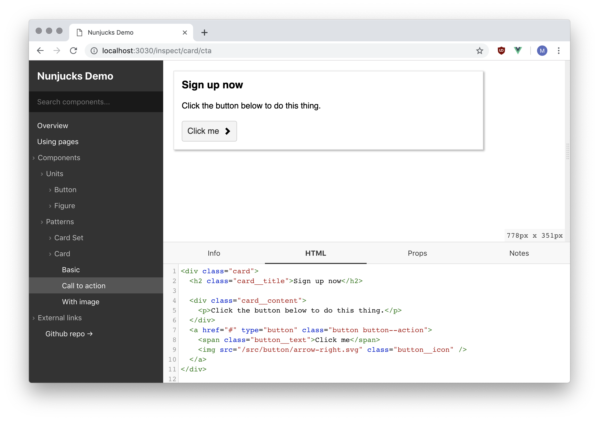
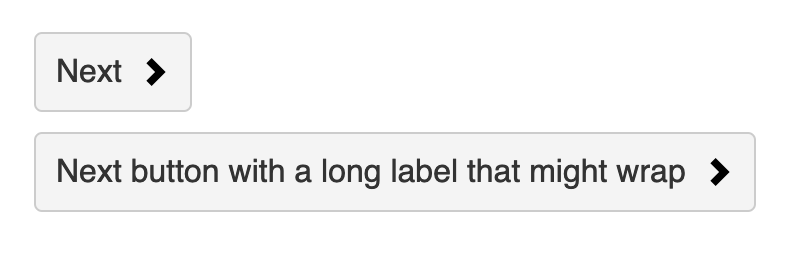

# Fractalite

A prototype to help explore development ideas for the next version of [Fractal](https://fractal.build).

[Features & Status](#features) | [Demo](#demo)  | [Documentation](#docs)

> Development work on a potential Fractal v2 release was halted a while ago after it became clear that it incorporated too many conceptual changes from v1 and the codebase had become too large and unwieldy.
>
> This prototype has been create to explore a middle ground, (hopefully) incorporating many of the v2 improvements into a package that is conceptually much closer to the current fractal v1.x release.

### 📣 We need your feedback! 📣

The aim of this prototype is to provide the ground work for the next version of Fractal. It's very much a work in progress and we'd love to get **as much input from the community as possible** to help shape that process.

**Please let us know your thoughts** by [opening a new issue using the 'Feedback' issue template](https://github.com/frctl/fractalite/issues/new?assignees=allmarkedup&labels=Feedback&template=feedback.md&title=Feedback+) or by jumping into the `#fractalite` channel in the [Fractal community Slack](http://slack.fractal.build) to discuss. Feel free to message `@mark` with any questions you might have!

---

<h2 id="features">🚦 Features & status</h2>

This prototype is in the very early 'developer preview' stages and is currently focussed on development direction alongside plugin and adapter APIs.

Feedback, comments and/or pull requests on **all** aspects of the prototype are however always welcome!

#### Currently implemented

* Middleware-based components parser/compiler
* [Plugin system](#plugins) for compiler and UI customisation
* [Adapter-based](#adapters) component rendering
* Completely customisable [nav generation](#navigaion)
* Easy [asset referencing](#view-template-assets) within components
* Dynamic page builder
* Zero-config [asset bundling](#assets-bundler-plugin) (via plugin)
* Hybrid client/server side-rendered UI (using [Vue](https://vuejs.org))
* Live-reloading development mode
* Static build export

#### Still missing/in progress

* [ ] Community feedback and input! :-)
* [ ] Proper UI design & implementation
  * [ ] Responsive UI
  * [ ] Loading states
  * [ ] Component search
  * [ ] Collapsible nav
  * [ ] Variables for theming
  * [ ] Landing page
* [ ] Tests
* [ ] Documentation
* [ ] Additional template engine adapters
  * [ ] Handlebars
  * [ ] Twig
  * [ ] React
  * [ ] Others...?
* [ ] More UI customisation hooks?
* [ ] More extensive feature demo
* [ ] Any other suggestions...?


<h2 id="demo">📺 Demo</h2>

The most full-featured demo is the [Nunjucks demo](demos/nunjucks). It uses the [Nunjucks adapter](packages/adapter-nunjucks) alongside the [Asset Bundler](packages/plugin-assets-bundler) and [Notes](packages/plugin-notes) plugins.

> The source code for the Nunjucks demo contains commented examples of some of the main features of this prototype and is worth investigating in conjunction with the web UI.



<small><em>Demo colour scheme shamelessly ripped off from the excellent [Kanbasu](https://kanbasu.liip.ch/2/) component library :-)</em></small>

### Running the demo

1. Download or clone this repo
2. `npm install` - install top-level dependencies
3. `npm run bootstrap`: bootstrap packages together (may take some time on first run!)

#### 🛠 Development mode

1. `npm run demo` - Start the development server
2. View the app: http://localhost:3030.

Changes to the Nunjucks components will be instantly reflected in the UI.

#### 📦 Static build mode

1. `npm run demo:build` - Export flat-file version of the app & serve the `dist` directory
2. View the static app: http://localhost:4040

Exported files can be found in the `demos/nunjucks/build` directory after export.

> As the name suggests, the static build is **not** regenerated when component files are updated.

_A hosted version of the static build [can be found here](https://build-ckzcnjurbt.now.sh/)_

#### Other demos

* [Vue demo](demos/vue) - Basic proof-of-concept, client-side rendered Vue integration. `npm run demo:vue`

<h2 id="docs">📚 Documentation</h2>

Below is some preliminary documentation to help get across some of the key aspects of the Fractalite prototype.

> This documentation assumes good knowledge of Fractal (v1) concepts and is not intended as a starter guide!

* [Installation](#installation)
* [Project Configuration](#project-configuration)
* **Components**
  * [Overview](#components)
  * [Scenarios](#scenarios)
  * [Configuration](#configuration)
  * [View templates](#view-templates)
* **Previews**
  * [Overview](#previews)
  * [Adding CSS & JS to previews](#preview-css-js)
  * [Customising preview markup](#preview-markup)
* **Pages**
  * [Overview](#pages)
  * [Usage](#pages-usage)
  * [Reference tags](#pages-reference-tags)
  * [Nunjucks templates](#pages-nunjucks-templates)
  * [Front Matter](#pages-frontmatter)
* **Application UI**
  * [Overview](#application-ui)
  * [Navigation](#navigation)
* **Plugins**
  * [Overview](#plugins)
  * [Example plugin - author info](#example-plugin-author-info)
  * [Assets bundler plugin](#assets-bundler-plugin)
  * [Notes plugin](#notes-plugin)
* **Adapters**
  * [Overview](#adapters)
  * [Structure of an adapter](#adapter-structure)
  * [Example adapter - Mustache](#adapter-example-mustache)
* **API**
  * [Compiler](#api-compiler)
  * [Application](#api-application)
  * [Renderer](#api-renderer)
  * [Component](#api-component)
  * [Page](#api-page)
  * [File](#api-file)

## Installation

**Note: Fractalite is not currently published to NPM.** The following steps are for information purposes only until published.

Install via NPM:

```bash
npm i @frctl/fractalite --save-dev
```

Add the following NPM scripts to the project `package.json` file:

```js
{
  "scripts": {
    "start": "fractalite start --port 3333",
    "build": "fractalite build"
  }
}
```

You can now start the Fractalite app by running the `npm start` command from within the project directory.

## Project Configuration

Fractalite config is kept in a `fractal.config.js` file in the project root directory. Only the `components` property is required.

```js
// fractal.config.js
const { resolve } = require('path');

module.exports = {
  // absolute path to the components directory
  components: resolve(__dirname, './src/components'),
};
```

> The Nunjucks demo contains a [annotated example](demos/nunjucks/fractal.config.js) of a project configuration file that contains more detail on the available options.

## Components

Each component is represented by a directory. The directory name must begin with an `@` symbol - for example `@button` or `@media-block`.

Each component directory will typically contain a set of files including as component config file, a view template file (or the framework-specific equivalent) and any other related assets.

The file structure for a basic [Nunjucks](https://mozilla.github.io/nunjucks) button component might look something like this:

```
@button
├── button.config.js
├── button.css
└── view.njk
```

### Scenarios

**Component scenarios** are a key concept in Fractalite.

A scenario provides an example implementation of the component by supplying a set of properties to render the component with.

> Scenarios are very similar to the concept of `variants` in Fractal v1, but refined and renamed to better suit the way in which v1 variants have been used in practice. They can also be thought of as similar to the 'story' concept in StorybookJS.

For example, a common use for a `button` component might be as a 'next' control. A simple scenario object representing that might look as follows:

```js
{
  name: 'next', // reference name
  label: 'Next step', // display in UI navigation
  props: {
    text: 'Go Next',
    icon: './arrow-right.png'
  }  
}
```

> `props` are similar to the `context` object in Fractal v1

Scenarios are defined in the **component config file**. The Fractalite UI creates a component preview for each scenario defined for that component.

Any relative paths to assets in the scenario `props` object are resolved to full URLs before rendering.

#### Rendering multiple scenario instances per preview

Sometimes you may want to render multiple instances of the same scenario in one preview window - say for example to test the `next` button scenario with labels of differing lengths:



To support this, each scenario can define a `preview` property as an array of props. Each item in this array will be **merged with the default scenario props**, and the preview will render one instance for each set of merged props.

```js
{
  name: 'next',
  props: {
    text: 'Go Next',
    icon: './arrow-right.png'
  },
  preview: [
    {
      label: 'Next'
    },
    {
      label: 'Next button with a long label that might wrap'
    }
  ]
}
```

The preview for this scenario will have two buttons in it, one for each of the preview items defined.

> See the [Previews](#previews) section for details on how to customise the preview markup.

#### Adapter integration

Template engine adapters such as the [Nunjucks adapter](packages/adapter-nunjucks) support including sub-components with scenario properties provided as their default property values:

```html
 <!-- include `button` component with no props -->
  <!-- include `button` component with props from `next` scenario -->
  <!-- include `button` component with props from `next` scenario merged with inline props -->
```

### Configuration

Component **config files** can be JSON, YAML or CommonJS module format, although the latter is recommended for flexibility.

Config files must be named `config.{ext}` or `{component-name}.config.{ext}` - for example `button.config.js` or `config.yml`.

CommonJS formatted files should export a configuration object:

```js
// @button/button.config.js
module.exports = {
  label: 'A basic button',
  // other config here...
};
```
#### Config properties

> See the demo button component for an [annotated example](demos/nunjucks/src/components/01-units/@button/button.config.js) of some of the available config options.

**`label`** [string]


The text that should be used to refer to the component in the UI. [_Defaults to a title-cased version of the component name._]

**`scenarios`** [array]

An array of [scenario objects](#scenarios).

```js
// button/button.config.js
module.exports = {
  scenarios: [
    {
      name: 'next',
      props: {
        text: 'Go Next',
        icon: './arrow-right.png'
      }  
    },
    {
      name: 'prev',
      props: {
        text: 'Go Prev',
        icon: './arrow-left.png'
      }  
    }
  ]
}
```

### View templates

View templates are **template-engine specific** files that contain the code required to render the component.

Fractalite **adapters** are responsible for determining how view templates are named, rendered and for any other framework/engine related integration details.

However, in the case of 'simple' template engines such as Nunjucks or Handlebars, views are typically templated fragments of HTML as in the following (Nunjucks) example:

```html
<!-- @button/view.njk -->
<a class="button" href="{{ href }}">
  <span class="button__text">{{ text }}</span>
</a>
```

More complex frameworks such as Vue or React may have different requirements and feature support will be determined by the adapter used.

<h4 id="view-template-assets">Linking to assets in view templates</h4>

Referencing local component assets in view templates can be done via relative paths:

```
@button
├── next-arrow.png
└── view.njk
```

```html
<!-- view.njk -->

```

Any relative paths in [html attributes that expect a URL value](https://www.npmjs.com/package/html-url-attributes) will be dynamically rewritten to reference the asset correctly.

## Previews

Rendered component instances are wrapped in an HTML document for previewing.

A typical project will need to be configured to inject the required styles and scripts into the preview to correctly display the component.

<h3 id="preview-css-js">Adding CSS & JS to previews</h3>

> The [assets bundler plugin](#assets-bundler-plugin) automatically injects bundled assets into previews so this step may not be needed if using it in your project.

The `preview` option in the  project config file lets you specify scripts and stylesheets to be  injected into to all component previews.

```js
// fractal.config.js
const { resolve } = require('path');

module.exports = {
  // ...
  preview: {
    /*
     * Assets can be specified as either:
     *
     * 1) an absolute path to the file
     * 2) an external URL
     * 3) or an object with 'url' and 'path' keys
     */
    stylesheets: [
      resolve(__dirname, './dist/styles.css'), // (1)
      'http://example.com/external-styles.css', // (2)
      {
        url: '/custom/url/path.css',
        path: resolve(__dirname, './dist/yet-more-styles.css')
      } // (3)
    ],
    scripts: [
      // scripts can be added in the same way as stylesheets
    ]
  }
};
```

Individual components can also add **local CSS/JS** files from within their directory using relative paths:

```
@button
├── preview.css
└── view.njk
```

```js
// @button/button.config.js
module.exports = {
  preview: [
    stylesheets: ['./preview.css'],
    scripts: [/* ... */],
  ]
}
```

> It's also possible to add 'inline' JS/CSS code to the previews using the `preview.css` and `preview.js` config options. See the Nunjucks demo [button component config](demos/nunjucks/src/components/01-units/@button/button.config.js) for an annotated example of this in action.

<h3 id="preview-markup">Customising preview markup</h3>

As well as adding assets, Fractalite also exposes a number of ways to completely customise the preview markup and output:

- Each individually rendered scenario instance can be wrapped in custom HTML using the `preview.wrapEach` option (available both **globally** and on a **component-by-component** basis)
- Each _set_ of scenario instances can be wrapped in custom html using the `preview.wrap` option (available both **globally** and on a **component-by-component** basis)
- The entire preview document template can also be completely overridden if required (only available as a global option)

#### Component-level example

```js
// @button/button.config.js
module.exports = {

  preview: {

    // add an in-preview title
    wrap(html, ctx) {
      return `
        <h4>${ctx.component.label} / ${ctx.scenario.label}</h4>
        ${html}`;
    },

    // wrap each item in the preview to space them out
    wrapEach(html, ctx) {
      return `<div style="margin-bottom: 20px">${html}</div>`;
    }
  }
}
```

#### Custom preview template example

> Note that preview templates are rendered using Nunjucks. The default preview template can be [found here](packages/fractalite/views/preview.njk) for reference.

```js
// fractal.config.js
module.exports = {
  // ...
  preview: {
    template: `
    <!DOCTYPE html>
    <html>
    <head>
      <link rel="stylesheet" href="{{ url }}">
      <style>{{ css | safe }}</style>
      <title>{{ meta.title | default('Preview') }}</title>
    </head>
    <body>
      <div id="app">
        <h1>A custom preview</h1>
        <div class="wrapper">
          {{ content | safe }}
        </div>
      </div>
      <script src="{{ url }}"></script>
      <script>{{ js | safe }}</script>
    </body>
    </html>
    `
  }
};
```

## Pages

Each project can specify a directory of pages to be displayed in the app.

Pages can either be Markdown documents (with a `.md` extension) or Nunjucks templates (with a `.njk` extension) and can define Jekyll-style [front matter](https://jekyllrb.com/docs/front-matter/) blocks for configuration options.

<h3 id="pages-usage">Usage</h3>

Add the absolute path to the pages directory to the project config file:

```js
// fractal.config.js
const { resolve } = require('path');
module.exports = {
  // ...
  pages: resolve(__dirname, './pages'), // absolute path to the pages directory
};
```

Then create the pages:

```
./pages
├── about.njk
└── index.md
```

> If an `index` file (either with `.md` or `.njk` extension) is added in the root of the pages directory then this will override the default application welcome page.

<h3 id="pages-reference-tags">Reference tags</h3>

Reference tags can be used in pages to make linking to other pages, component previews and source files both easier and less fragile. They also allow basic access to properties of page and component objects.

Reference tags take the form `{target:identifier:property}`.

* `target`: one of `component`, `page`, `file`, `inspect` or `preview`
* `identifier`: unique identifier for the target - for example the component name or page handle
* `property`: optional, defaults to `url`  

Some example reference tags:

```html
 <!-- button component inspector URL -->
{inspect:button}

 <!-- standalone preview URL for button component with 'next scenario' -->
{preview:button/next}

 <!-- URL of raw source of the button view template -->
{file:button/view.njk}

<!-- URL of the about page -->
{page:about}

<!-- title of the about page -->
{page:about:title}
```

<h3 id="pages-nunjucks-templates">Nunjucks templates</h3>

Nunjucks templates (pages with a `.njk` extension) have access to the current compiler state properties as well as any data provided in the front matter block:

```html
<!-- about.njk -->
<p>The following components are available</p>
<ul>
  
  <li><a href="{{ component.url }}">{{ component.label }}</a></li>
    
</ul>
```

<h3 id="pages-frontmatter">Front Matter</h3>

The following page configuration options are available and can be set in a front matter block at the top of pages that require it.

**`title`** [string]

The title displayed at the top of the page.

**`label`** [string]

Used to refer to the page in any navigation

**`handle`** [string]

Used in reference tags to refer to the page. Defaults to the page URL with slashes replaced by dashes.

**`markdown`** [boolean]

Whether or not to run the page contents through the markdown renderer. _[Defaults to `true` for `.md` pages, false for all others.]_

**`template`** [boolean]

Whether or not to run the page contents through the Nunjucks renderer. _[Defaults to `true` for `.njk` pages, false for all others.]_

## Application UI

Many aspects of the Fractalite UI can be configured, customised or overridden.

### Navigation

The sidebar navigation contents can be customised in the project `fractal.config.js` config file using the `nav.items` property.

The value of this property can either be an array of navigation items or a generator function that returns an array of items.

Each item in the nav array should *either* be an object with the following properties:

* `label`: Text to be displayed for the nav item
* `url`: URL to link to (if `children` are not specified)
* `children`: Array of child navigation items (if `url` is not specified)

*Or* it an be a `Page`, `Component` or `File` instance. `Component` instances will automatically have their scenarios added as child items.

If no value for the `nav.items` property is supplied then the default nav generator will be used which includes links to all pages and components.

#### Hard-coding items

Most projects will want to dynamically generate their navigation, however it may occasionally be useful to hard-code the nav for some use cases.

```js
// fractal.config.js
module.exports = {
  // ...
  nav: {
    items: [
      {
        label: 'Welcome',
        url: '/'
      },
      {
        label: 'Components',
        children: [
          {
            label: 'Next Button',
            url: '/inspect/button/next'
          },
          {
            label: 'Call to Action',
            url: '/inspect/cta/default'
          }
        ]
      },
      {
        label: 'Github',
        url: 'https://github.com/org/project'
      },
    ]
  }
};
```

#### Dynamically generating items

A generator function can be supplied instead of hard-coding the items.

The generator will receive the compiler `state` as its first argument and a `toTree` utility function as the second argument. The `toTree` utility can be used to generate a file-system based tree from a flat array of components or files.

The generator function should return an array of navigation items in the same format as the hard-coded example above.

The example below shows components can be filtered before generating the navigation:

```js
// fractal.config.js
module.exports = {
  // ...
  nav: {
    items(state, toTree){
      // filter components by some custom property in the config
      const components = state.components.filter(component => {
        return component.config.customProp = true;
      });
      // return the navigation tree
      return [
        {
          label: 'Components',
          children: state.components // flat list of filtered components
        },
        {
          label: 'Pages',
          children: toTree(state.pages) // tree of pages
        }
      ];
    }
  }
};
```

## Plugins

Plugins the primary way that the Fractalite app can be customised, and can affect both the UI and the component parsing/compilation process.

Plugins are added in the project config file:

```js
// fractal.config.js
module.exports = {
  plugins: [
    require('./plugins/example')({
      // customisation opts here
    })
  ]
};
```

A plugin is a function that receives `app`, `compiler` and `renderer` instances as it's arguments.

A useful pattern is to wrap the plugin function itself in a 'parent' function so that it can receive runtime options:

```js
// plugins/example.js
module.exports = function(opts = {}){
  // any plugin initialiation here
  return function(app, compiler, renderer){
    // this is the plugin function itself
    console.log('This is an example plugin');
  }
};
```

### Example plugin - author info

The following is an example of a fairly basic plugin that reads author information from component config files and adds a tab to the component inspector UI to display this information.

```js
// plugins/author-info.js
module.exports = function(opts = {}) {
  return function authorPlugin(app, compiler) {

    const authorDefaults = {
      name: 'Unknown Author',
      email: null
    };

    /*
     * First add a compiler middleware function
     * to extract author info from the component config
     * and create a .author property on the component
     * object with a normalized set of properties.
     */
    compiler.use(components => {
      components.forEach(component => {
        const authorConfig = component.config.author || {};
        component.author = { ...authorDefaults, ...authorConfig };
      });
    });

    /*
     * Then add an inspector panel to display the
     * author information in the UI. The panel templates
     * are rendered using Nunjucks and have access to the
     * current component, scenario and compiler state.
     */
    app.addInspectorPanel({
      name: 'component-author',
      label: 'Author Info',
      template: `
         <div class="author-panel">
           <h3>Author information</h3>
           <ul>
             <li><strong>Name:</strong> {{ component.author.name }}</li>
             
             <li><strong>Email:</strong> {{ component.author.email }}</li>
             
           </ul>
         </div>
       `,
       css: `
        .author-panel {
          padding: 20px;
        }
        .author-panel ul {
          margin-top: 20px;
        }
      `
    });
  };
};
```
Author information can then be added to component config files and will be displayed in the UI:

```js
// @button/button.config.js
module.exports = {
  author: {
    name: "Daffy Duck",
    email: 'daffy@duck.com'
  }
}
```

> Note that in the simple example above the compiler middleware could have been skipped in favour of a little more verbosity in the template. In more complex real-world examples however this is not always the case.

### Assets bundler plugin

The [asset bundler plugin](packages/plugin-assets-bundler) uses [Parcel](https://parceljs.org) to provide a zero-config asset bundling solution for Fractalite.

It handles asset compilation, hot module reloading (HMR) and automatically adds all generated assets into Fractalite component previews.

First add it to the project config file:

```js
// fractal.config.js
module.exports = {
  // ...  
  plugins: [
    require('@frctl/fractalite-plugin-assets-bundler')({
      entryFile: './src/preview.js',
      outFile: './dist/build.js'
    })
  ]
};
```

Then create the global entry file to bundle the required assets as per your project requirements. An example might look like this:

```js
// ./assets/preview.js
import '../components/**/*.scss'
import button from '../components/@button/button.js'
```

> See the Parcel docs on module resolution for more info on paths, globbing and aliases: https://parceljs.org/module_resolution.html

#### Dynamic entry file building

The asset bundler also support dynamic creation of the entry file using the `entryBuilder` config option.

The entry builder will be re-run whenever changes are made to the components directory.

```js
const { relative } = require('path');

const bundlerPlugin = require('@frctl/fractalite-plugin-assets-bundler')({

  /*
   * The entryBuilder function receives state and context
   * objects and should return a string of the entry file contents.
   *
   * This example dynamically build an entry file that imports all
   * css files from components.
   */
  entryBuilder(state, ctx) {
    let entry = '';
    state.files.filter(f => f.ext === '.scss').forEach(file => {
      entry += `import '${relative(ctx.dir, file.path)}'\n`; // import paths need to be relative to the ctx.dir property
    });
    return entry;
  },

  // entry and out files must still be specified
  entryFile: './src/preview.js',
  outFile: './dist/build.js'
})
```

### Notes plugin

The [notes plugin](packages/plugin-notes) adds a inspector panel to display component notes.

Notes can be defined via the `notes` property in the component config file, or alternatively kept in a markdown file in the component directory.

```js
// fractal.config.js
module.exports = {
  // ...  
  plugins: [
    require('@frctl/fractalite-plugin-notes')({
      notesFile: 'notes.md' // optional, only if notes should be read from files
    })
  ]
};
```

## Adapters

Adapters allow Fractalite to support many different template engines and frameworks.

Fractalite currently supports a single adapter per project. Adapters are specified in the project configuration file:

```js
// fractal.config.js
module.exports = {
  adapter: require('./example-adapter.js')({
    // customisation opts here
  })
};
```

All adapters **must** provide a `render` function which receives a component, a set of props, and a state object and returns a string representing the rendered component.

Adapters also have access to both the `compiler` and the `app` instances so can also perform much more complicated integration with the application if required.

<h3 id="adapter-structure">Structure of an adapter</h3>

An adapter is a function that receives `app` and `compiler` instances as it's arguments, and must return a **render function** or an **adapter object that includes a render function amongst its properties**.

As with [plugins](#plugins), a useful pattern is to wrap the adapter function itself in a 'parent' function so that it can receive runtime options:

```js
// example-adapter.js
module.exports = function(opts = {}){
  // any adapter initialiation here
  return function(app, compiler){
    // do anything with app/compiler here
    return function render(component, props, state){
      // do rendering here...
      return html;
    }
  }
};
```

Render functions can be asynchronous  - just return a `Promise` that resolves to the HTML string.

<h3 id="adapter-example-mustache">Example adapter - Mustache</h3>

The following example is for a basic adapter for Mustache templates. To keep it simple it does not include support for partials.

```js
const Mustache = require('mustache');

module.exports = function(opts = {}) {
  /*
   * Allow users to override the default view name
   */
  const viewName = opts.viewName || 'view.mustache';

  return function mustacheAdapter() {
    /*
     * Asynchronous render function.
     *
     * Looks for a matching view file in the list of component files,
     * reads it's contents and then renders the string using the
     * Mustache.render method.
     */
    return async function render(component, props) {
      const tpl = component.files.find(file => file.basename === viewName);
      if (!tpl) {
        throw new Error(`Cannot render component - no view file found.`);
      }
      const tplContents = await tpl.getContents();
      return Mustache.render(tplContents, props);
    };
  };
};

```

## API

<h2 id="api-compiler">Compiler</h2>

#### `compiler.use(fn)`

Push a compiler middleware function onto the stack.

Middleware receive the `components` array as the first argument, and a Koa-style `next` function as the second argument.

Middleware can mutate the contents of the components array as needed. Asynchronous middleware is supported.

**Unlike in Koa middleware** the `next` function _only_ needs to be called if the middleware should wait for latter middleware to complete before running.

```js
// 'plain' middleware, no awaiting
compiler.use(components => {
  components.forEach(component => {
    // ...
  })
})

// 'asynchronous' middleware
compiler.use(async components => {
  await theAsyncTask();
  components.forEach(component => {
    // ...
  })
})

// middleware that waits for latter middleware to complete first
compiler.use(async (components, next) => {
  await next();
  components.forEach(component => {
    // ...
  })
})
```

#### `compiler.getState()`

Returns an object representing the current state of the compiler. By default this includes `components` and `files` properties.

```js
const state = compiler.getState();

state.components.forEach(component => {
  console.log(component.name);
});

state.files.forEach(component => {
  console.log(component.path);
});
```

#### `compiler.parse()`

Re-parse the component directory and update the internal compiler state. Returns a Promise that resolves to a state object.

<h2 id="api-application">Application</h2>

### Properties

#### `app.mode`
#### `app.router`
#### `app.views`

### UI

#### `app.addInspectorPanel(props)`
#### `app.getInspectorPanels()`
#### `app.removeInspectorPanel(name)`

### Previews

#### `app.addPreviewStylesheet(url, [path])`
#### `app.addPreviewScript(url, [path])`
#### `app.addPreviewCSS(css)`
#### `app.addPreviewJS(js)`
#### `app.beforeScenarioRender(fn)`
#### `app.afterScenarioRender(fn)`
#### `app.beforePreviewRender(fn)`
#### `app.afterPreviewRender(fn)`
#### `app.addPreviewWrapper(fn, wrapEach)`

### Routing

#### `app.addRoute(name, path, handler)`
#### `app.url(name, params)`

### Lifecycle

#### `app.beforeStart(fn)`
#### `app.on(event, handler)`
#### `app.emit(event, [...args])`

### Views

#### `app.addViewPath(path)`
#### `app.addViewExtension(name, ext)`
#### `app.addViewFilter(name, filter)`
#### `app.addViewGlobal(name, value)`

### Assets

#### `app.addStylesheet(url, [path])`
#### `app.addScript(url, [path])`
#### `app.addCSS(css)`
#### `app.addJS(js)`
#### `app.addStaticDir(name, path, [mount])`
#### `app.serveFile(url, path)`

### Utils

#### `app.utils.renderMarkdown(str)`
#### `app.utils.highlightCode(code)`
#### `app.utils.parseFrontMatter(str)`
#### `app.utils.renderPage(str, [props], [opts])`
#### `app.utils.addReferenceLookup(key, handler)`

### Other

#### `app.extend(methods)`

<h2 id="api-renderer">Renderer</h2>

#### `renderer.render(component, props)`
#### `renderer.renderAll(component, arrayOfProps)`

<h2 id="api-component">Component</h2>

### Properties

#### `component.name`
#### `component.label`
#### `component.config`
#### `component.files`
#### `component.scenarios`
#### `component.isComponent`
#### `component.root`
#### `component.path`
#### `component.relative`
#### `component.url`
#### `component.previewUrl`

### Methods

#### `component.matchFiles(matcher)`

<h2 id="api-page">Page</h2>

### Properties

#### `page.label`
#### `page.title`
#### `page.position`
#### `page.url`
#### `page.isPage`

### Methods

#### `page.getContents()`

<h2 id="api-file">File</h2>

### Properties

#### `file.name`
#### `file.path`
#### `file.relative`
#### `file.basename`
#### `file.dirname`
#### `file.extname`
#### `file.ext`
#### `file.stem`
#### `file.stats`
#### `file.size`
#### `file.url`
#### `file.isFile`

### Methods

#### `file.setContents(str)`
#### `file.getContents()`
